# Ivan Lukichev

Building web products, games, and small online tools since 2006.

My work focuses on independent web projects, browser games, and practical utilities designed for quick use directly in the browser.

🌐 Website  
https://lukichev.biz/

---

## Main Project

### PuzzleFree

Browser-based jigsaw puzzle platform.

  

| Product | Website | Apps |
| --- | --- | --- |
| PuzzleFree | https://puzzlefree.game | [App Store](https://apps.apple.com/id6751572041) · [Google Play](https://play.google.com/store/apps/details?id=com.enidev.puzzlefree) |
| Kids Puzzle | https://puzzlefree.game/kids/ | [App Store](https://apps.apple.com/app/id6761406530) · [Google Play](https://play.google.com/store/apps/details?id=com.enidev.puzzlefreekids) |

---

## Web Projects

A collection of small independent web products and experiments.

<table>
  <tr>
    <td width="50%" valign="top">
       
      <strong>PickWinner</strong> 
      Randomizers and quick decision tools for instant everyday use. 
      <a href="https://pickwinner.tools">site</a> · <a href="https://github.com/ivanlukichev/pickwinner">GitHub</a>
    </td>
    <td width="50%" valign="top">
       
      <strong>HTTPTools</strong> 
      Lightweight web utilities for headers, redirects, and quick protocol checks. 
      <a href="https://httptools.net">site</a> · <a href="https://github.com/ivanlukichev/httptools-landing">GitHub</a>
    </td>
  </tr>
  <tr>
    <td width="50%" valign="top">
       
      <strong>SPA: SEO Page Audit</strong> 
      Browser extension for quick local on-page SEO checks and popup audits. 
      <a href="https://apps.apple.com/app/spa-seo-page-audit/id6761405738">App Store</a> · <a href="https://github.com/ivanlukichev/spa-seo-audit-landing">GitHub</a>
    </td>
    <td width="50%" valign="top">
      <a href="https://clockwidgets.com/">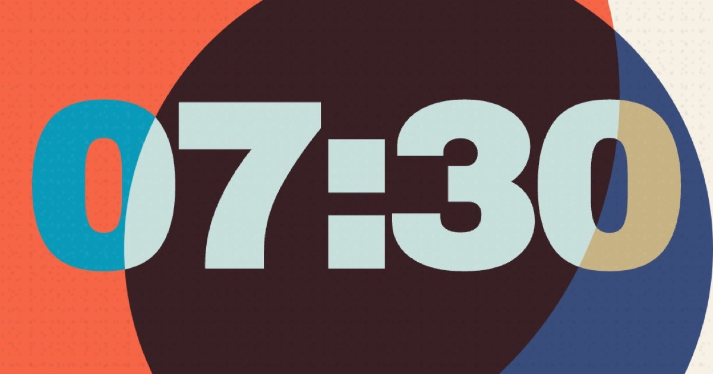</a> 
      <strong>Clock Widgets</strong> 
      Flip and digital clock widgets for iPhone and iPad — Home Screen and Lock Screen styles you can match to your mood. 
      <a href="https://clockwidgets.com/">site</a> · <a href="https://apps.apple.com/app/id6772222315">App Store</a> · <a href="https://play.google.com/store/apps/details?id=com.enidev.clockwidgets">Google Play</a>
    </td>
  </tr>
  <tr>
    <td width="50%" valign="top">
      <a href="https://morsecodes.app/">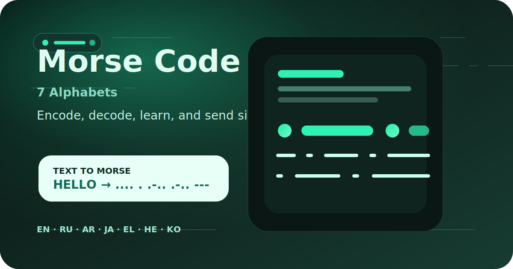</a> 
      <strong>Morse Code</strong> 
      Offline Morse encoder, decoder, learning, and signal app for seven alphabets. 
      <a href="https://morsecodes.app/">site</a> · <a href="https://apps.apple.com/app/id6764839522">App Store</a> · <a href="https://play.google.com/store/apps/details?id=com.enidev.morse">Google Play</a>
    </td>
    <td width="50%" valign="top">
      <a href="https://wise-husband.com/">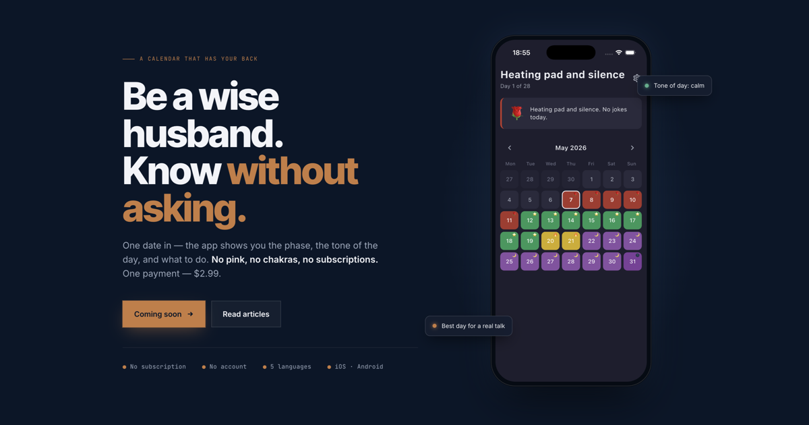</a> 
      <strong>Wise Husband</strong> 
      Cycle calendar for husbands — one calm screen with a daily line you can read half-asleep. 
      <a href="https://wise-husband.com/">site</a> · <a href="https://apps.apple.com/app/id6767145321">App Store</a> · <a href="https://play.google.com/store/apps/details?id=com.enidev.wisehusband">Google Play</a>
    </td>
  </tr>
  <tr>
    <td width="50%" valign="top">
       
      <strong>HowLoud</strong> 
      Clean, fast iOS decibel meter for everyday noise checks. Pairs with the browser sound meter on PickHeadphones. 
      <a href="https://pickheadphones.com/tools/sound-meter/">site</a> · <a href="https://apps.apple.com/app/id6767616413">App Store</a> · <a href="https://play.google.com/store/apps/details?id=com.enidev.decibelmeter">Google Play</a>
    </td>
    <td width="50%" valign="top">
      <a href="https://apps.apple.com/app/id6771039438">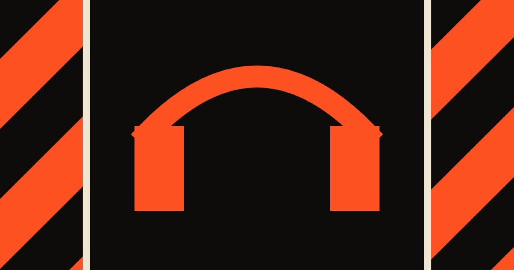</a> 
      <strong>Headphone Test</strong> 
      Native iPhone companion to PickHeadphones — left/right, stereo balance, bass pulse, frequency sweep, and mic checks in one app. 
      <a href="https://pickheadphones.com/">site</a> · <a href="https://apps.apple.com/app/id6771039438">App Store</a>
    </td>
  </tr>
</table>

---

## Games

Browser games built for quick play sessions.

<table>
  <tr>
    <td width="50%" valign="top">
       
      <strong>Colorful Hearts</strong> 
      Private offline coloring game for children and families. 
      <a href="https://colouringapp.com/">site</a> · <a href="https://apps.apple.com/app/id6764305398">App Store</a>
    </td>
    <td width="50%" valign="top">
      <a href="https://beadart.app/">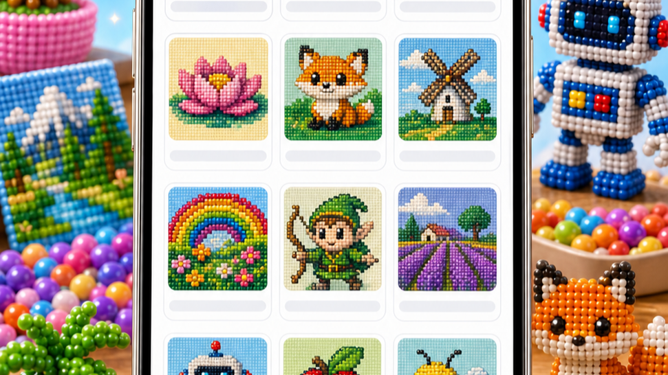</a> 
      <strong>BeadArt</strong> 
      Relaxing bead mosaic game with colorful numbered grids and calm picture-building flow. 
      <a href="https://beadart.app/">site</a> · <a href="https://apps.apple.com/app/id6766010170">App Store</a> · <a href="https://play.google.com/store/apps/details?id=com.enidev.beadart">Google Play</a>
    </td>
  </tr>
  <tr>
    <td width="50%" valign="top">
      <a href="https://pixelpaintapp.com/">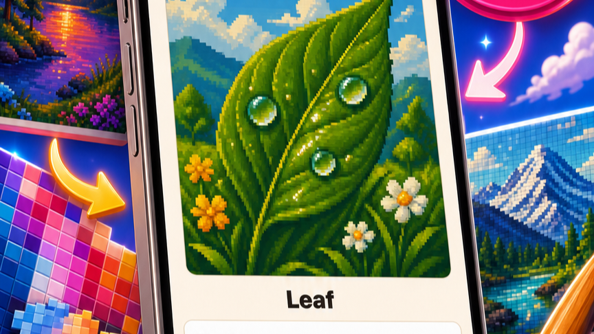</a> 
      <strong>PixelPaint</strong> 
      Photo-to-pixel-art coloring game for relaxed offline painting and playful pixel puzzles. 
      <a href="https://pixelpaintapp.com/">site</a> · <a href="https://apps.apple.com/app/id6765738643">App Store</a> · <a href="https://play.google.com/store/apps/details?id=com.enidev.pixelcolor">Google Play</a>
    </td>
    <td width="50%" valign="top">
       
      <strong>Block Play Game</strong> 
      Minimalist block puzzle with smooth gameplay, satisfying combos, and a calm visual style — on web, iOS, and Android. 
      <a href="https://blockplaygame.com">site</a> · <a href="https://apps.apple.com/app/id6762732976">App Store</a> · <a href="https://play.google.com/store/apps/details?id=com.enidev.flowblocks">Google Play</a> · <a href="https://github.com/ivanlukichev/playblockgame-en-landing">GitHub</a>
    </td>
  </tr>
  <tr>
    <td width="50%" valign="top">
       
      <strong>PlayBlockGame</strong> 
      Russian-first block puzzle with instant rounds. 
      <a href="https://playblockgame.ru">site</a> · <a href="https://github.com/ivanlukichev/playblockgame-ru-landing">GitHub</a>
    </td>
    <td width="50%" valign="top">
       
      <strong>Word Chain Chat</strong> 
      Live word duels by category — quick chat-style rounds where players take turns naming words. 
      <a href="https://word-chain-game.com">site</a> · <a href="https://apps.apple.com/app/id6775745201">App Store</a> · <a href="https://play.google.com/store/apps/details?id=com.enidev.wordchain">Google Play</a> · <a href="https://github.com/ivanlukichev/wordchain-landing">GitHub</a>
    </td>
  </tr>
  <tr>
    <td width="50%" valign="top">
       
      <strong>Goroda</strong> 
      Classic city-chain game blending language and geography. 
      <a href="https://goroda-na.ru">site</a> · <a href="https://apps.apple.com/app/id6769050447">App Store</a> · <a href="https://play.google.com/store/apps/details?id=com.enidev.goroda">Google Play</a> · <a href="https://t.me/igra_goroda_online_bot">Telegram</a> · <a href="https://github.com/ivanlukichev/gorodana-public">GitHub</a>
    </td>
    <td width="50%" valign="top">
       
      <strong>Solitaire</strong> 
      Classic browser solitaire for quick relaxing sessions. 
      <a href="https://играть-пасьянс.рф">site</a> · <a href="https://github.com/ivanlukichev/solitaire-landing">GitHub</a>
    </td>
  </tr>
  <tr>
    <td width="50%" valign="top">
       
      <strong>Tic-Tac-Toe</strong> 
      Quick classic browser game with instant casual play. 
      <a href="https://крестики-нолики.рф">site</a> · <a href="https://github.com/ivanlukichev/tictactoe-landing">GitHub</a>
    </td>
    <td width="50%" valign="top">
       
      <strong>Sudoku Play</strong> 
      Classic, daily, and kids Sudoku in a clean browser-first format. 
      <a href="https://sudoku-play.org/">site</a> · <a href="https://github.com/ivanlukichev/sudokuplay-landing">GitHub</a> · <a href="https://apps.apple.com/app/id6763089363">App Store</a> · <a href="https://play.google.com/store/apps/details?id=com.enidev.justsudoku">Google Play</a> · <a href="https://sudoku-play.org/sudoku-for-kids/">Kids site</a> · <a href="https://apps.apple.com/app/id6764041492">Kids App</a> · <a href="https://play.google.com/store/apps/details?id=com.enidev.kidssudoku">Kids Google Play</a>
    </td>
  </tr>
  <tr>
    <td width="50%" valign="top">
       
      <strong>PlayMathPuzzles</strong> 
      Logic-driven number crosswords and math puzzle layouts. 
      <a href="https://playmathpuzzles.com/">site</a> · <a href="https://github.com/ivanlukichev/playmathpuzzles-landing">GitHub</a>
    </td>
    <td width="50%" valign="top">
       
      <strong>Слова из Слова</strong> 
      Russian word game built around one base word and many hidden combinations. 
      <a href="https://slova-game.ru/">site</a> · <a href="https://github.com/ivanlukichev/slovagame-public">GitHub</a>
    </td>
  </tr>
  <tr>
    <td width="50%" valign="top">
       
      <strong>CalcSprint</strong> 
      Fast mental math drills built for daily repetition. 
      <a href="https://calcsprint.com">site</a> · <a href="https://github.com/ivanlukichev/calcsprint-landing">GitHub</a> · <a href="https://apps.apple.com/app/id6763547636">App Store</a> · <a href="https://play.google.com/store/apps/details?id=com.enidev.calcsprint">Google Play</a> · <a href="https://calcsprint.com/kids/">Kids</a> · <a href="https://apps.apple.com/app/id6784570701">Kids App Store</a>
    </td>
    <td width="50%" valign="top">
       
      <strong>Number Hunt</strong> 
      Speed-and-focus game for spotting numbers in sequence. 
      <a href="https://numberhuntgame.com/">site</a> · <a href="https://github.com/ivanlukichev/numberhunt-landing">GitHub</a>
    </td>
  </tr>
  <tr>
    <td width="50%" valign="top">
       
      <strong>Nonograms.pics</strong> 
      Daily nonograms, picross puzzles, categories, and beginner guides. 
      <a href="https://nonograms.pics/">site</a> · <a href="https://github.com/ivanlukichev/nonograms-pics-landing">GitHub</a>
    </td>
    <td width="50%" valign="top">
       
      <strong>SkillSudoku</strong> 
      Sudoku project with a guide layer and search-friendly content hub. 
      <a href="https://skillsudoku.com/">site</a> · <a href="https://github.com/ivanlukichev/skillsudoku-landing">GitHub</a>
    </td>
  </tr>
  <tr>
    <td width="50%" valign="top">
      <a href="https://slidepuzzle.app/">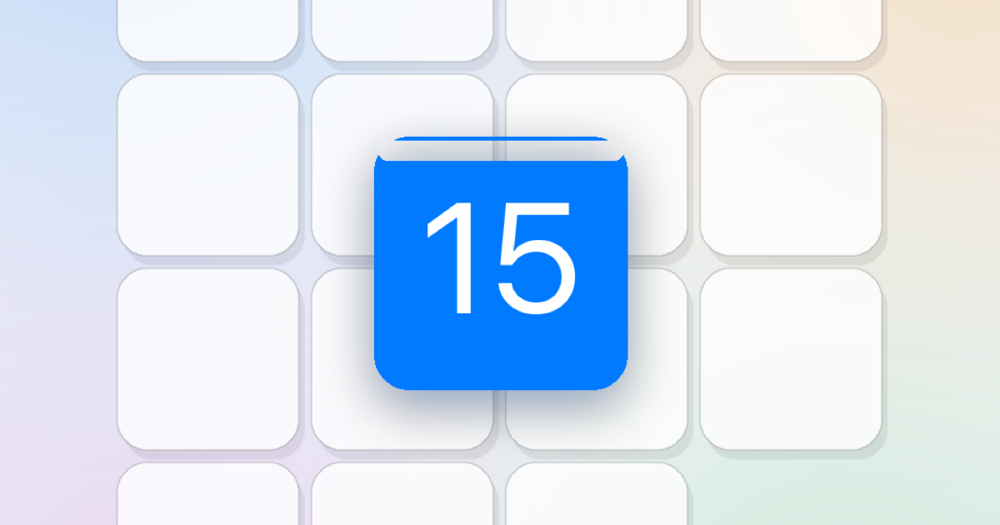</a> 
      <strong>Slide Puzzle</strong> 
      Modern take on the classic 15 puzzle — slide tiles to rebuild the image on 3×3, 4×4, 5×5, and 6×6 boards. 
      <a href="https://slidepuzzle.app/">site</a> · <a href="https://apps.apple.com/app/id6770205599">App Store</a> · <a href="https://play.google.com/store/apps/details?id=com.enidev.slidepuzzle">Google Play</a>
    </td>
    <td width="50%" valign="top">
       
      <strong>ОткрыткаОнлайн</strong> 
      Free generator of festive Russian-style postcards — pick a background, write a phrase, share the image. 
      <a href="https://otkritkaonline.com/">site</a>
    </td>
  </tr>
  <tr>
    <td width="50%" valign="top">
       
      <strong>Easy Jigsaw Puzzles</strong> 
      Free browser jigsaw puzzles across ten themes, 4 to 144 pieces, with a native iOS companion app. 
      <a href="https://easyjigsawpuzzles.com/">site</a> · <a href="https://apps.apple.com/app/id6772980224">App Store</a> · <a href="https://play.google.com/store/apps/details?id=com.enidev.easypuzzle">Google Play</a>
    </td>
    <td width="50%" valign="top">
      <a href="https://pullme.app/">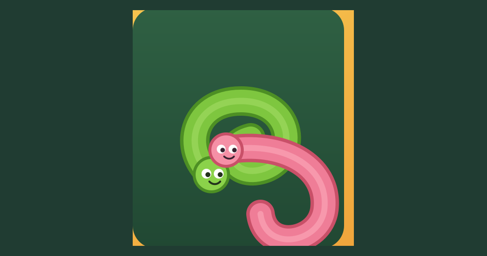</a> 
      <strong>Pull Me</strong> 
      Freedom for the worms — pull each little critter free across 100 free levels. 
      <a href="https://pullme.app/">site</a> · <a href="https://apps.apple.com/app/id6775017077">App Store</a> · <a href="https://play.google.com/store/apps/details?id=com.enidev.ropes">Google Play</a>
    </td>
  </tr>
  <tr>
    <td width="50%" valign="top">
       
      <strong>WordSpin</strong> 
      Quiet crossword puzzle — drag letters on a circular wheel to spell words and fill the grid. 460 hand-crafted levels. 
      <a href="https://wordspin.app/">site</a> · <a href="https://apps.apple.com/app/id6774131462">App Store</a> · <a href="https://play.google.com/store/apps/details?id=com.enidev.wordspin">Google Play</a>
    </td>
    <td width="50%" valign="top">
      <a href="https://watchfacekit.com/">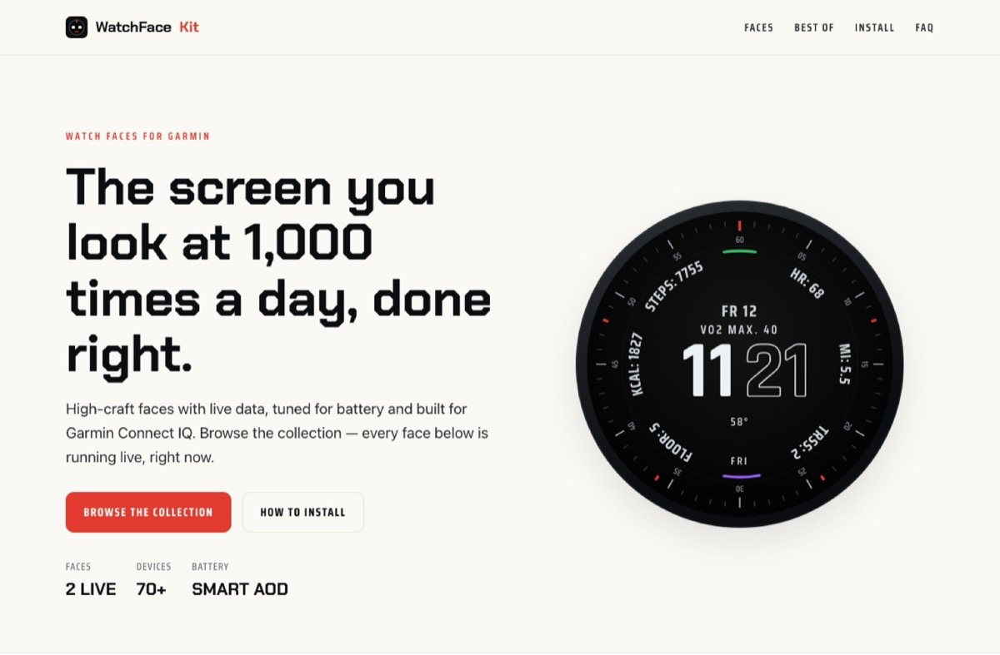</a> 
      <strong>WatchFace Kit</strong> 
      Curated watch faces for Garmin Connect IQ — high-craft displays with live data, tuned for battery, ready to install. 
      <a href="https://watchfacekit.com/">site</a>
    </td>
  </tr>
  <tr>
    <td width="50%" valign="top">
      <a href="https://arrows-puzzle.com/">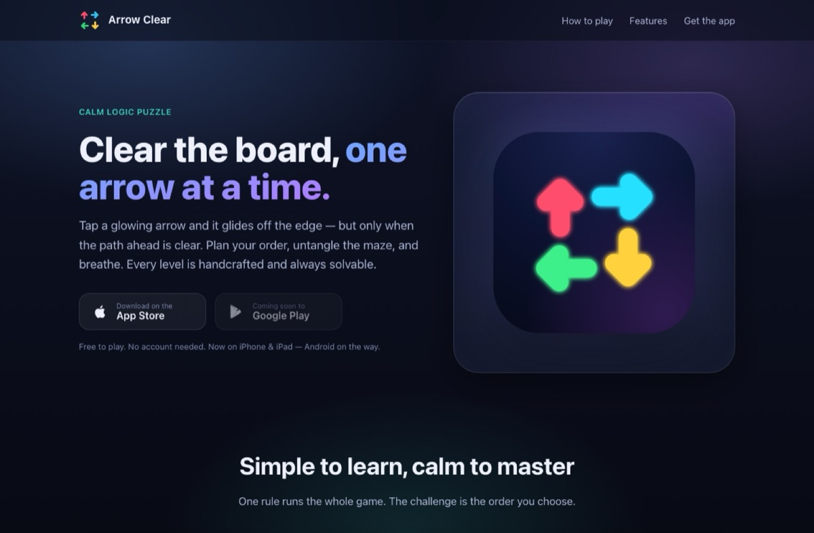</a> 
      <strong>Arrows Puzzle</strong> 
      Calm neon logic puzzle — tap a glowing arrow and it glides off the edge, but only when the path ahead is clear. 
      <a href="https://arrows-puzzle.com/">site</a> · <a href="https://apps.apple.com/app/id6777918234">App Store</a> · <a href="https://play.google.com/store/apps/details?id=com.enidev.puzzlearrow">Google Play</a>
    </td>
    <td width="50%" valign="top">
      <a href="https://coffeeline.app/">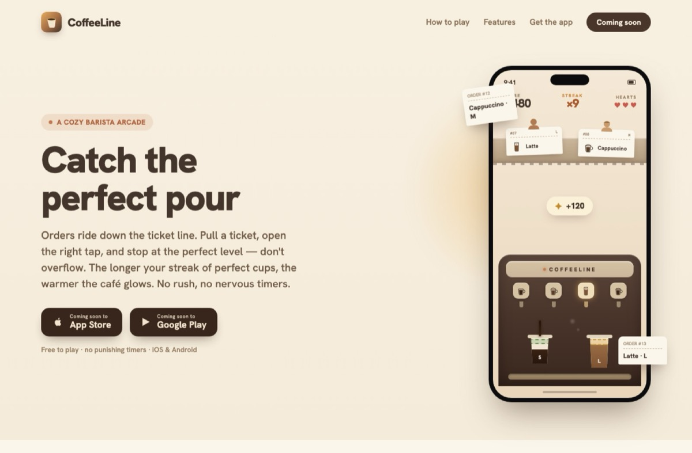</a> 
      <strong>CoffeeLine</strong> 
      A cozy barista arcade — orders ride down the ticket line, pull a ticket, open the right tap, stop at the perfect level. No rush, no nervous timers. 
      <a href="https://coffeeline.app/">site</a> · <a href="https://apps.apple.com/app/id6784132379">App Store</a>
    </td>
  </tr>
  <tr>
    <td width="50%" valign="top">
      <a href="https://favoritelullaby.com/">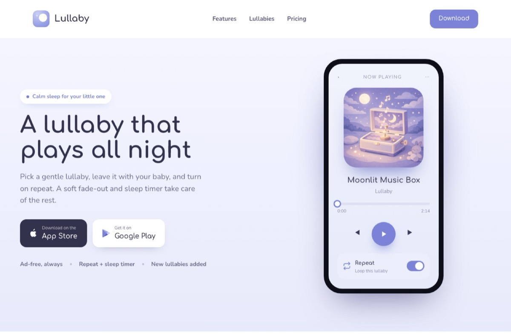</a> 
      <strong>Lullaby</strong> 
      A gentle lullaby that plays all night — pick a song, turn on repeat, and let the fade-out and sleep timer take care of the rest. 
      <a href="https://favoritelullaby.com/">site</a> · <a href="https://apps.apple.com/app/id6787460650">App Store</a>
    </td>
    <td width="50%" valign="top">
      <a href="https://geoquizzes.app/">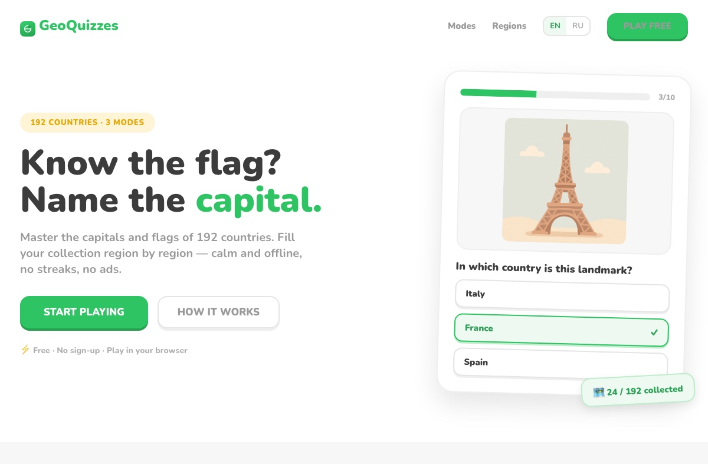</a> 
      <strong>GeoQuizzes</strong> 
      A calm geography quiz — flags, capitals, and landmarks at your own pace. Offline, no ads, no subscriptions; Europe free, unlock the world once. 
      <a href="https://geoquizzes.app/">site</a> · <a href="https://apps.apple.com/app/id6789140184">App Store</a>
    </td>
  </tr>
</table>

### 🚀 Extensions & Apps

Chrome Web Store · [Firefox Add-ons](https://addons.mozilla.org/firefox/user/19809108/) · [Edge Add-ons](https://microsoftedge.microsoft.com/addons/search?developer=Ivan%20Lukichev) · [App Store](https://apps.apple.com/developer/lukichev-ivan/id1889426687) · Google Play  

---

## About

Independent web developer focused on:

- browser games  
- small web tools  
- SEO-driven web products  
- experiments in distribution and product design  

More projects:  
https://lukichev.biz/
