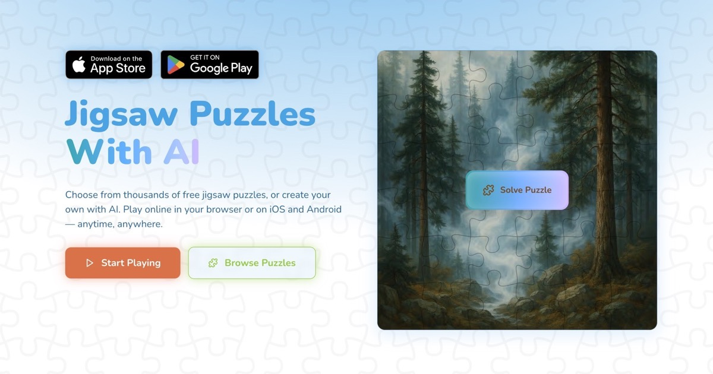

# Ivan Lukichev

Building web products, games, and small online tools since 2006.

My work focuses on independent web projects, browser games, and practical utilities designed for quick use directly in the browser.

🌐 Website  
https://lukichev.biz/

---

## Main Project

### PuzzleFree

Browser-based jigsaw puzzle platform.

  

🌐 https://puzzlefree.game

📱 Apps  
https://play.google.com/store/apps/details?id=com.enidev.puzzlefree  
https://apps.apple.com/id6751572041

---

## Web Projects

A collection of small independent web products and experiments.

<table>
  <tr>
    <td width="50%" valign="top">
       
      <strong>PickWinner</strong> 
      Randomizers and quick decision tools for instant everyday use. 
      <a href="https://pickwinner.tools">site</a> · <a href="https://github.com/ivanlukichev/pickwinner">GitHub</a>
    </td>
    <td width="50%" valign="top">
       
      <strong>HTTPTools</strong> 
      Lightweight web utilities for headers, redirects, and quick protocol checks. 
      <a href="https://httptools.net">site</a> · <a href="https://github.com/ivanlukichev/HTTPTools">GitHub</a>
    </td>
  </tr>
  <tr>
    <td width="50%" valign="top">
       
      <strong>PickHeadphones</strong> 
      Simple browser-based audio tests for headphones and speakers. 
      <a href="https://pickheadphones.com">site</a> · <a href="https://github.com/ivanlukichev/PickHeadphones">GitHub</a>
    </td>
    <td width="50%" valign="top">
       
      <strong>SPA: SEO Page Audit</strong> 
      Browser extension for quick local on-page SEO checks and popup audits. 
      <a href="https://github.com/ivanlukichev/spa-seo-page-audit">GitHub</a>
    </td>
  </tr>
</table>

---

## Games

Browser games built for quick play sessions.

<table>
  <tr>
    <td width="50%" valign="top">
       
      <strong>BlockPlay</strong> 
      Clean browser block puzzle for fast score runs. 
      <a href="https://blockplaygame.com">site</a> · <a href="https://github.com/ivanlukichev/BlockPlay-Game">GitHub</a>
    </td>
    <td width="50%" valign="top">
       
      <strong>PlayBlockGame</strong> 
      Russian-first block puzzle with instant rounds. 
      <a href="https://playblockgame.ru">site</a> · <a href="https://github.com/ivanlukichev/PlayBlockGame">GitHub</a>
    </td>
  </tr>
  <tr>
    <td width="50%" valign="top">
       
      <strong>Word Chain Game</strong> 
      Vocabulary game where each word starts with the last letter of the previous one. 
      <a href="https://word-chain-game.com">site</a> · <a href="https://github.com/ivanlukichev/Word-Chain-Game">GitHub</a>
    </td>
    <td width="50%" valign="top">
       
      <strong>Goroda</strong> 
      Classic city-chain game blending language and geography. 
      <a href="https://goroda-na.ru">site</a> · <a href="https://github.com/ivanlukichev/Goroda-na">GitHub</a>
    </td>
  </tr>
  <tr>
    <td width="50%" valign="top">
       
      <strong>Solitaire</strong> 
      Classic browser solitaire for quick relaxing sessions. 
      <a href="https://играть-пасьянс.рф">site</a> · <a href="https://github.com/ivanlukichev/-">GitHub</a>
    </td>
    <td width="50%" valign="top">
       
      <strong>Tic-Tac-Toe</strong> 
      Quick classic browser game with instant casual play. 
      <a href="https://крестики-нолики.рф">site</a> · <a href="https://github.com/ivanlukichev/---">GitHub</a>
    </td>
  </tr>
  <tr>
    <td width="50%" valign="top">
       
      <strong>Sudoku Play</strong> 
      Classic, daily, and kids Sudoku in a clean browser-first format. 
      <a href="https://sudoku-play.org/">site</a> · <a href="https://github.com/ivanlukichev/Sudoku-Play">GitHub</a> · <a href="https://apps.apple.com/app/id6763089363">App Store</a>
    </td>
    <td width="50%" valign="top">
       
      <strong>PlayMathPuzzles</strong> 
      Logic-driven number crosswords and math puzzle layouts. 
      <a href="https://playmathpuzzles.com/">site</a> · <a href="https://github.com/ivanlukichev/PlayMathPuzzles">GitHub</a>
    </td>
  </tr>
  <tr>
    <td width="50%" valign="top">
       
      <strong>Слова из Слова</strong> 
      Russian word game built around one base word and many hidden combinations. 
      <a href="https://slova-game.ru/">site</a> · <a href="https://github.com/ivanlukichev/SlovaGame">GitHub</a>
    </td>
    <td width="50%" valign="top">
       
      <strong>CalcSprint</strong> 
      Fast mental math drills built for daily repetition. 
      <a href="https://calcsprint.com">site</a> · <a href="https://github.com/ivanlukichev/CalcSprint">GitHub</a> · <a href="https://apps.apple.com/app/id6763547636">App Store</a>
    </td>
  </tr>
  <tr>
    <td width="50%" valign="top">
       
      <strong>Number Hunt</strong> 
      Speed-and-focus game for spotting numbers in sequence. 
      <a href="https://numberhuntgame.com/">site</a> · <a href="https://github.com/ivanlukichev/numberhuntgame">GitHub</a>
    </td>
    <td width="50%" valign="top">
       
      <strong>Nonograms.pics</strong> 
      Daily nonograms, picross puzzles, categories, and beginner guides. 
      <a href="https://nonograms.pics/">site</a> · <a href="https://github.com/ivanlukichev/nonograms.pics_public">GitHub</a>
    </td>
  </tr>
  <tr>
    <td width="50%" valign="top">
       
      <strong>SkillSudoku</strong> 
      Sudoku project with a guide layer and search-friendly content hub. 
      <a href="https://skillsudoku.com/">site</a> · <a href="https://github.com/ivanlukichev/skillsudoku_public">GitHub</a>
    </td>
  </tr>
</table>

### 🚀 Extensions & Apps

Chrome Web Store · [Firefox Add-ons](https://addons.mozilla.org/firefox/user/19809108/) · [Edge Add-ons](https://microsoftedge.microsoft.com/addons/search?developer=Ivan%20Lukichev) · App Store · Google Play  

---

## About

Independent web developer focused on:

- browser games  
- small web tools  
- SEO-driven web products  
- experiments in distribution and product design  

More projects:  
https://lukichev.biz/
